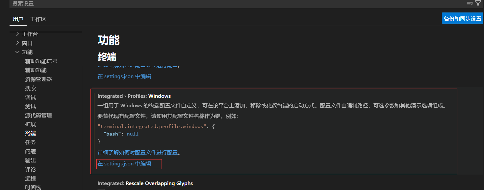

# Anaconda安装使用教程和VScode配合Anaconda开发

## 1.概述

conda是一个开源包管理器，环境管理器。用于安装多个版本的软件包及其依赖关系，并在它们之间轻松切换。

conda 分为 anaconda 和 miniconda，anaconda 是一个包含了许多常用库的集合版本，miniconda 是精简版本（只包含conda、pip、zlib、python 以及它们所需的包），剩余的通过 conda install command 命令自行安装。

> 使用anaconda的原因：
>
> 1）python2和python3在语法上是不兼容的，很多程序有适用python版本，若是都想在自己电脑上运行，需要创建虚拟环境。而anaconda可以满足要求，例如可以创建多种指定python版本的的虚拟环境：python=2.7或者python=3.8这种都可以满足。不影响系统原先安装的python。
>
> 2）不会影响系统自带Python。
>
> 3）conda：列出所需其他依赖包，安装包时自动安装其依赖项，可以便捷地在包的不同版本中自由切换。
>
> 4）conda适用语言：适用于Python, R, Ruby, Lua, Scala, Java, JavaScript, C/C++, FORTRAN。

## 2.安装

**Anaconda 官网**：[**https://www.anaconda.com/download**](https://www.anaconda.com/download)

官网下载速度较慢，可在清华的镜像站下载：https://mirrors.tuna.tsinghua.edu.cn/

按照系统设置获取所需的安装包。

本文展示在window下安装anaconda的过程。

### 2.1初始安装

若是电脑中并没有安装python，也不影响anaconda的安装，anaconda自带python。

点击安装包直接进行安装，注意：1）选择安装类型时，选择**“Just Me”**安装；2）选择安装位置时，路径**不能**含有**空格**，同时不能是**“unicode”**编码；3）在“Advanced Installation Options”中，**不要**勾选“Add Anaconda to my PATH environment variable.”（“添加Anaconda至我的环境变量。”）。因为如果勾选，则将会影响其他程序的使用。

一路安装到最后进入“Thanks for installing Anaconda!”界面则意味着安装成功，点击“Finish”完成安装。如果不想了解“Anaconda云”和“Anaconda支持”，则可以**不勾选**“Learn more about Anaconda Cloud”和“Learn more about Anaconda Support”。

### 2.2验证

window 用户打开Anaconda Prompt：

~~~
conda --version # 返回conda版本号则说明安装成功
~~~

### 2.3换源

因为Anaconda的下载源默认在国外，如果不配置我们国内源的话，下载速度会慢到怀疑人生。而且很多时候会导致网络错误而下载失败。

~~~
#打开Anaconda Prompt
conda config --add channels https://mirrors.tuna.tsinghua.edu.cn/anaconda/pkgs/free/
    
conda config --add channels https://mirrors.tuna.tsinghua.edu.cn/anaconda/pkgs/main/ 

conda config --add channels https://mirrors.tuna.tsinghua.edu.cn/anaconda/cloud/conda-forge/
conda config --add channels https://mirrors.tuna.tsinghua.edu.cn/anaconda/cloud/bioconda/

conda config --add channels https://mirrors.bfsu.edu.cn/anaconda/cloud/bioconda/

conda config --add channels https://mirrors.bfsu.edu.cn/anaconda/cloud/conda-forge/

conda config --add channels https://mirrors.bfsu.edu.cn/anaconda/pkgs/free/

conda config --add channels https://mirrors.bfsu.edu.cn/anaconda/pkgs/main/

# windows 用户无法直接创建 .condarc 文件，需要通过指令
conda config --set show_channel_urls yes
~~~

.condarc 文件在C:\Users\~\文件夹下。可用Notepad++查看修改。

~~~
#查看已经添加的channels
conda config --get channels
或
conda info  #查看详细信息
~~~

此时需要注意有时候.condarc 文件中的配置信息语法可能会有问题，或者说满足不了后续我们更新conda或是创建虚拟环境所用，可能会在后续操作中报错：python CondaValueError: Malformed version string ‘~’: invalid character(s).所以此处再放一个可以用的配置信息：

~~~
show_channel_urls: true
default_channels:
  - https://mirrors.tuna.tsinghua.edu.cn/anaconda/pkgs/main
  - https://mirrors.tuna.tsinghua.edu.cn/anaconda/pkgs/r
  - https://mirrors.tuna.tsinghua.edu.cn/anaconda/pkgs/msys2
custom_channels:
  conda-forge: https://mirrors.tuna.tsinghua.edu.cn/anaconda/cloud
  msys2: https://mirrors.tuna.tsinghua.edu.cn/anaconda/cloud
  bioconda: https://mirrors.tuna.tsinghua.edu.cn/anaconda/cloud
  menpo: https://mirrors.tuna.tsinghua.edu.cn/anaconda/cloud
  pytorch: https://mirrors.tuna.tsinghua.edu.cn/anaconda/cloud
  simpleitk: https://mirrors.tuna.tsinghua.edu.cn/anaconda/cloud
ssl_verify: true
~~~

此外，很多时候也是因为conda版本太旧需要更新的缘故，所以需要更新conda:

~~~
conda update conda
~~~

若在更新的过程中，报错：InvalidVersionSpecError: Invalid version spec: =2.7

解决方法：修改～/anaconda3/lib/python3.7/site-packages/conda/models/version.py

~~~
这一行
version_relation_re = re.compile(r'(==|!=|<=|>=|<|>)(?![=<>!])(\S+)$')
改成
version_relation_re = re.compile(r'(==|!=|<=|>=|<|>|=)(?![=<>!])(\S+)$')

这两行
opdict = {'==': op.__eq__, '!=': op.__ne__, '<=': op.__le__,
          '>=': op.__ge__, '<': op.__lt__, '>': op.__gt__}
改成
opdict = {'==': op.__eq__, '!=': op.__ne__, '<=': op.__le__, '=': lambda x, y: x.startswith(y),
   '>=': op.__ge__, '<': op.__lt__, '>': op.__gt__}
~~~

若在换源的过程中出错，需要回头重新配置：

~~~
conda config --remove-key channels #恢复默认镜像源
~~~

## 3.创建虚拟环境

### 3.1创建环境

~~~
# 模式
conda create --name <env_name> <package_names>
# 例子
--name 也可用 -n替代
可指定python版本
conda create -n env_name python=3.8
~~~

### 3.2查看环境

~~~
conda env list
或
conda info --envs
~~~

创建的conda虚拟环境文件可在Anaconda安装目录 envs文件下找到。

### 3.3删除环境

~~~
conda remove --name <env_name> --all # <env_name> 为被删除环境的名称
或
conda env remove -n <env_name>
~~~

### 3.4将环境重命名

~~~
conda create -n de --clone py  	# 将 py 重命名为 de
~~~

### 3.5激活环境

~~~
conda activate 环境名 # linux或者windows

source activate 环境名 #linux

activate 环境名# windows
~~~

### 3.6退出环境

~~~
conda deactivate
~~~

### 3.7获取当前环境中已安装包信息

~~~
conda list
~~~

## 4.安装包

~~~
# 在当前环境中安装包
conda install 包名称

# 指定版本号
conda install 包名称=version

# 在指定环境中安装包
conda install -n 环境名 包名称
例：conda install --name py3 pandas # 在名为“py3”的环境中安装pandas包

# 在指定环境中使用pip进行安装包，则需要先切换到指定环境中，再使用pip命令安装包
pip install 包名称 -i https://pypi.tuna.tsinghua.edu.cn/simple   #清华镜像

pip install 包名称 -i  https://pypi.douban.com/simple    #豆瓣镜像

#pip可以安装一些conda无法安装的包；conda也可以安装一些pip无法安装的包。因此当使用一种命令无法安装包时，可以尝试用另一种命令

# 案例
conda activate env_name  		# 进入环境

conda install numpy=1.93
或
pip  install numpy==1.93

conda deactivate				# 安装完之后记得退出环境

# 用“which 软件名”来查看该软件安装的位置
which numpy
~~~

## 5.删除包

~~~
# 删除当前环境的包
conda remove 包名称

# 卸载指定环境中的包
conda remove -n 环境名 包名称
~~~

## 6.更新包

~~~
# 更新所有包
conda update --all
conda upgrade --all

# 更新指定包
conda update <package_name>
conda upgrade <package_name>

# 更新多个指定包，则包名以空格隔开
例： conda update pandas numpy matplotlib # 更新pandas、numpy、matplotlib包。
~~~

## 7.迁移conda 环境

~~~
#打包迁移的环境
conda pack -n 虚拟环境名称 -o environment.tar.gz

如果报错：No command ‘conda pack’
尝试使用：conda install -c conda-forge conda-pack
~~~

复制压缩文件到新的电脑环境，进到conda的安装目录：/anaconda(或者miniconda)/envs/

~~~
# 对于 ubuntu 可以通过 whereis conda 查看 conda的安装路径
# cd 到 conda 的安装路径
mkdir environment

# 解压conda环境：
tar -xzvf environment.tar.gz -C  environment

# 查看迁移的虚拟环境
conda env list
~~~

## 8.VScode 终端配合anaconda开发测试

1）打开vscode的设置项的终端

2）设置默认终端配置文件为Command Prompt

3）修改路径

找到`Terminal › Integrated › Profiles: Window`，之后点击`edit in setting.json`，然后进入`setting.json`

修改"args"即可。修改的内容来自于Anconda Prompt属性中的目标信息。如图：

最终可在vscode的终端看到：

